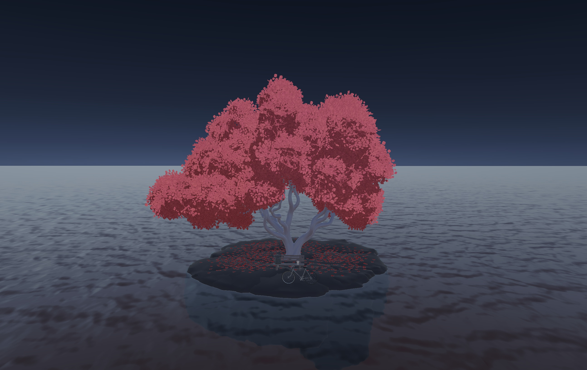
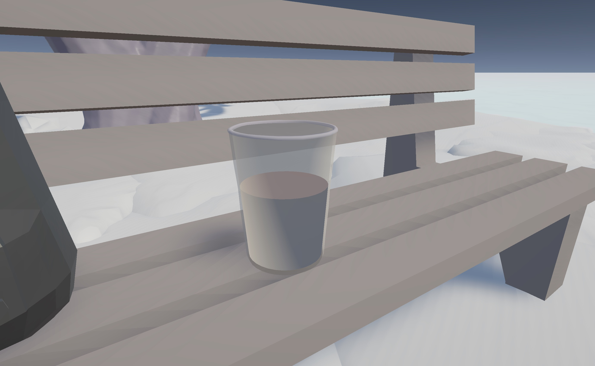
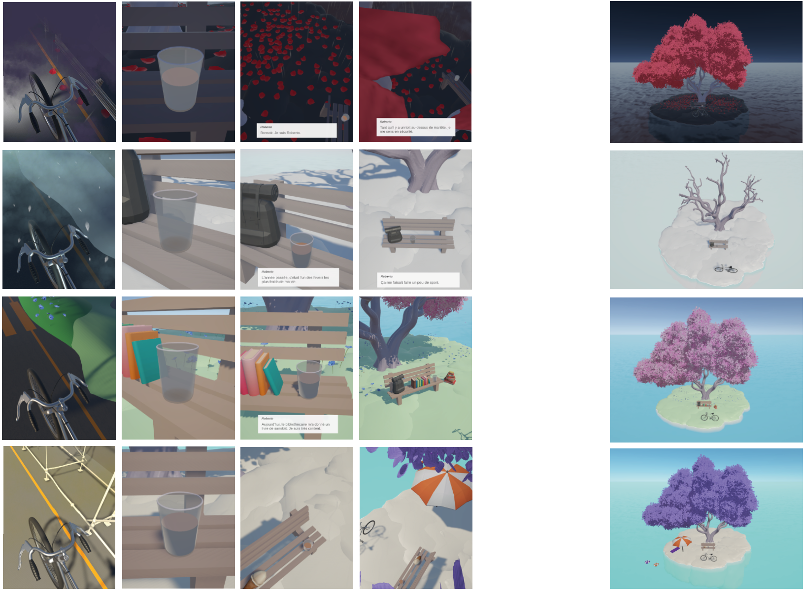

# Thé ou Café

A interactive iPad story inspired by the night patrols conducted in Geneva by social workers’ associations, it explores various encounters with people living on the streets through moments of presence and human connection. Season after season, we meets Roberto, a person living on the street, who gradually reveals more of his personality each time, and through these repeated meetings, a relationship slowly takes shape between them.

The visitor is invited to slow down and listen. The time devoted to each conversation depends on the simple act of pouring a glass of a hot drink: the longer it is filled, the more the story unfolds.

As the seasons go past, relationships evolve and fragments of lives emerge gradually - sometimes quiet, sometimes unexpected. Some connections form instantly; others require patience and repeated visits. The narrative is conveyed exclusively through voice and is inspired by testimonies gathered during the research phase from social workers and people who live in the street.

# Folders

- PressKit: [press/](press/README.md)
- Research and Production Process, documented daily: [process/](process/README.md)
- Code: [unity/](unity/README.md)

# Credits

- HEAD Master Media Design - Workshop Care
- June 2026 - Collaboration avec Bibliothèque de la Cité

## Team

- Elena Gazzarrini
- Vincent Paley 
- Antony Neyret