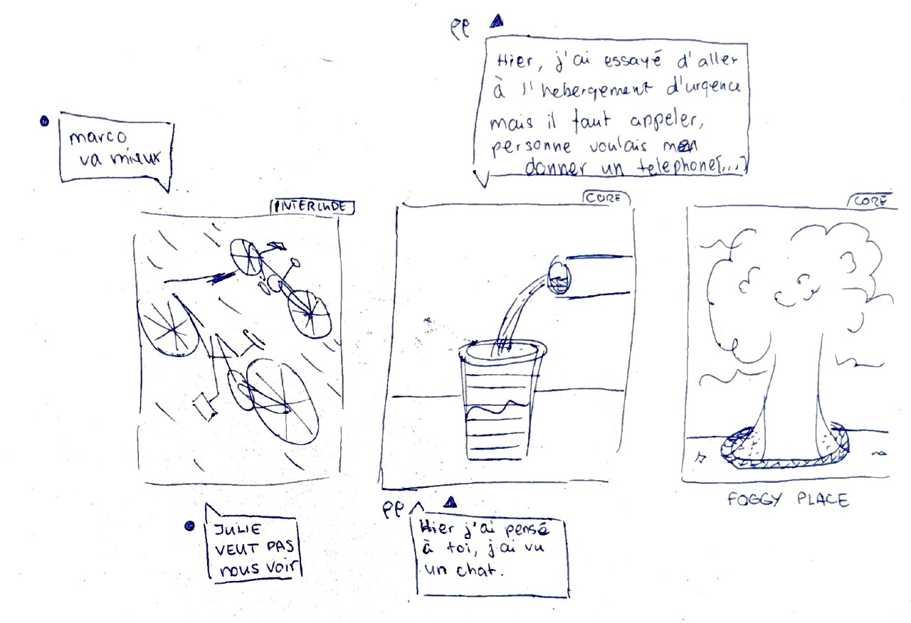
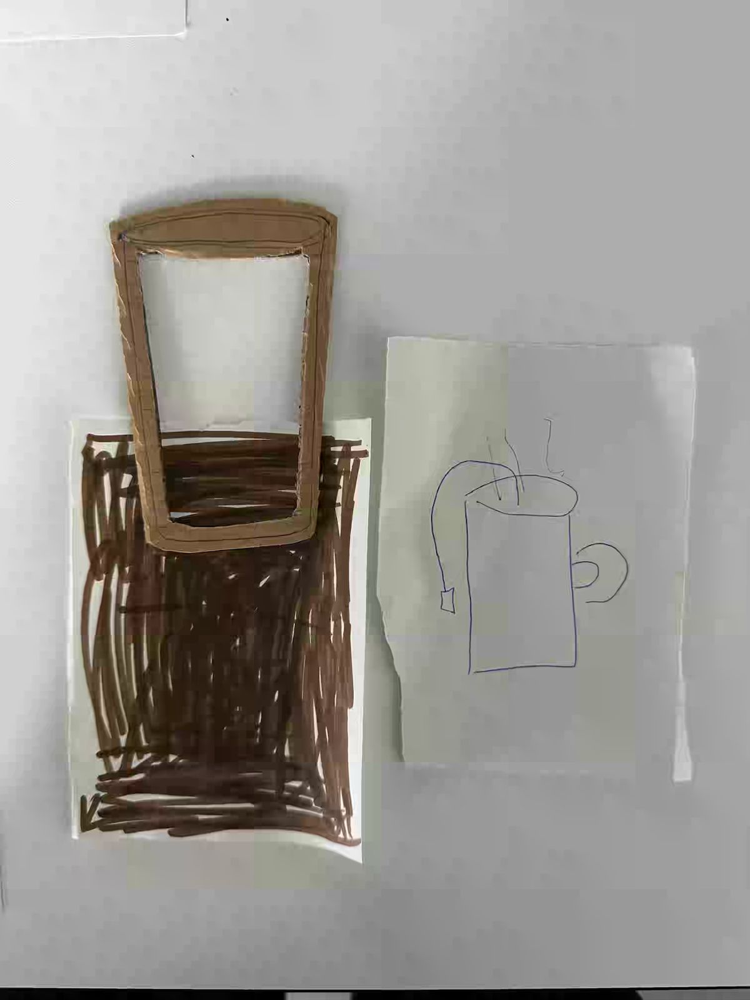
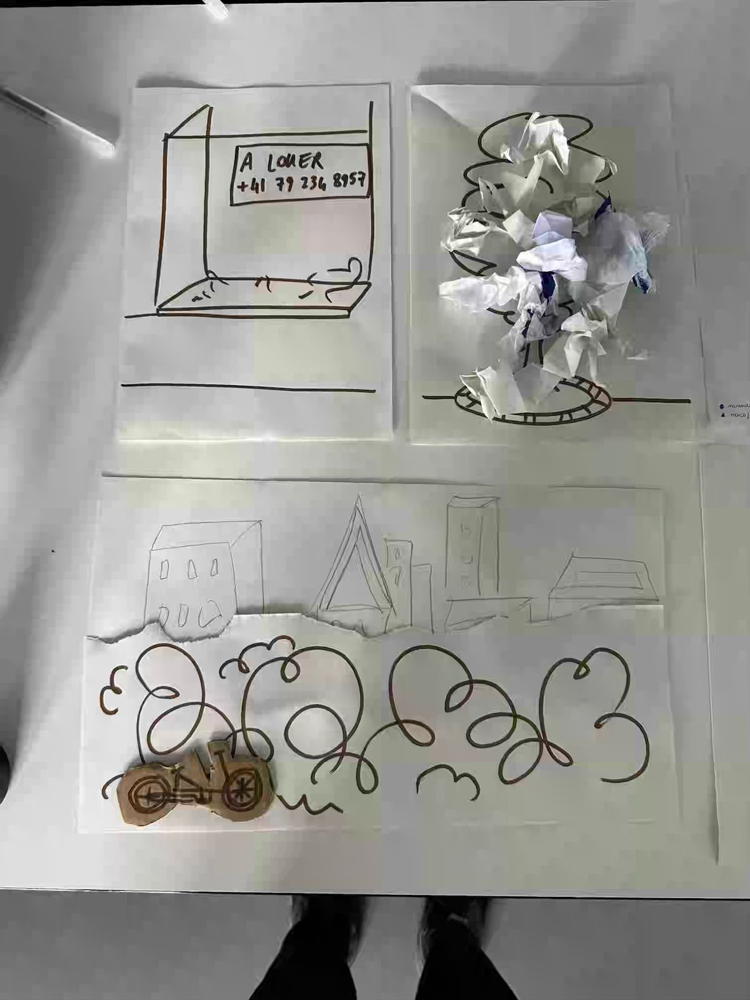
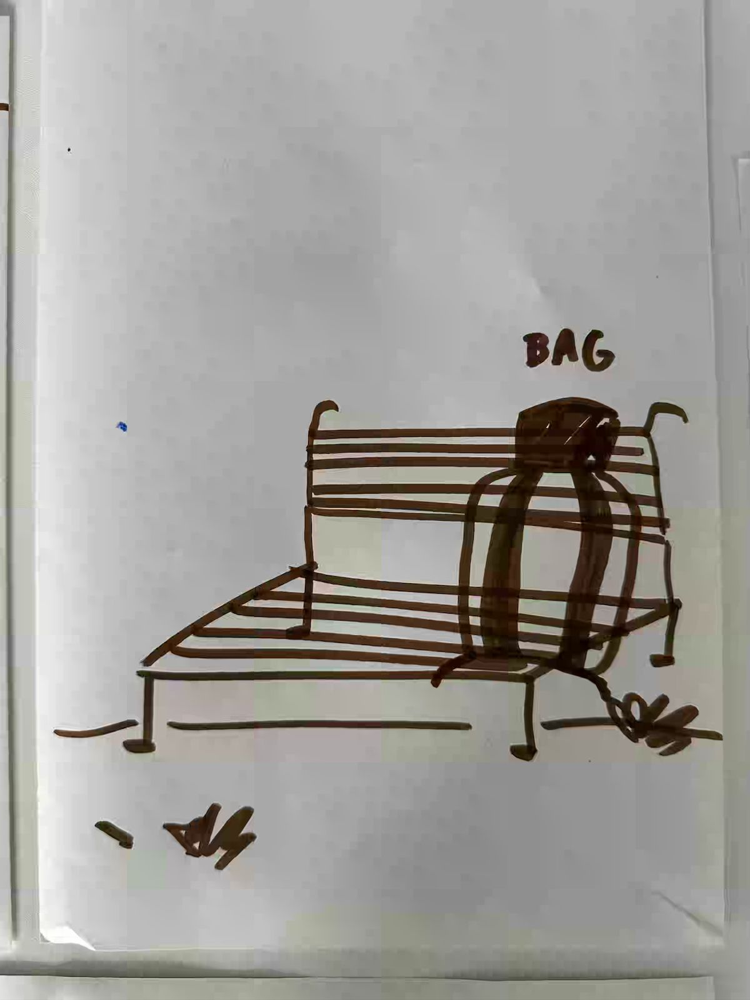
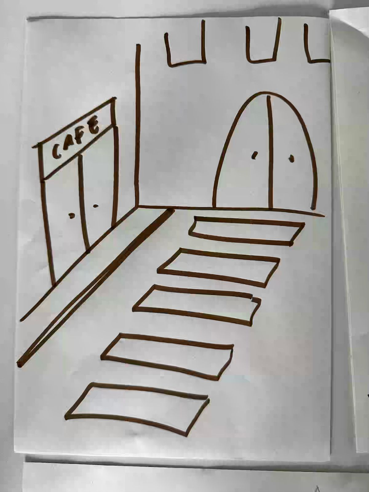
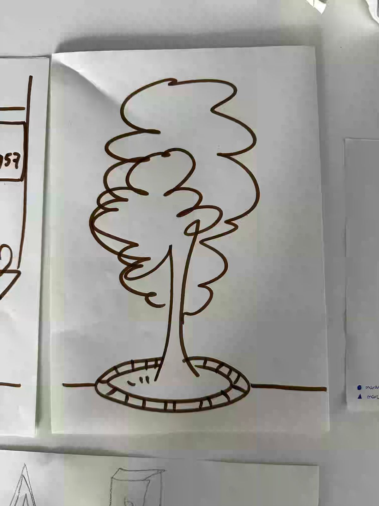
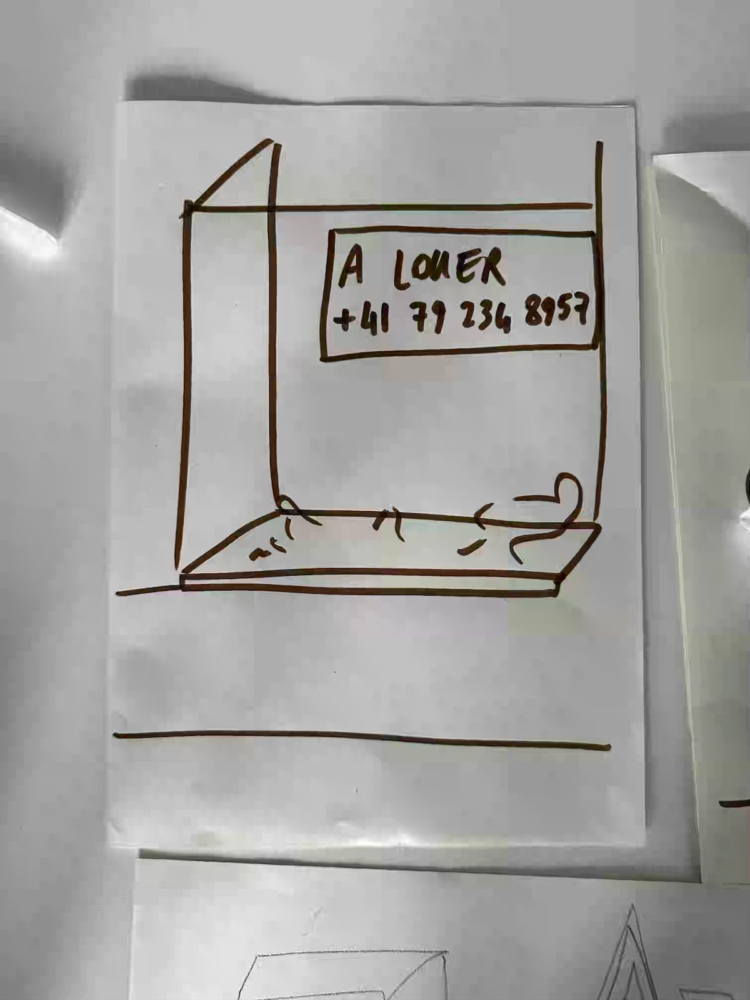

# 2026-05-20

Two people on their bicycles pedal through the grey streets; through the fog, they see Marco sitting on a bench under a big tree, next to his stack of luggages. As they approach and offer him a tea or a coffee, the fog lifts up and reveals details about the surrounding environment. The cup empties as the conversation unfolds. We follow them as they repeat the simple act of offering tea or coffee to people inhabiting the streets of Geneva as the night evolves.

### Globals

1. Bike
2. Filling the cup = you get what you give
3. Fog remove from the tree (see below)

|  |  |
| ---------------------------- | --------------------------- |
### Scenes

|  |  |  |  |
| ---------------------------- | ----------------------------- | --------------------------- | --------------------------- |
Followup process [2026-05-19](../../process/journal/2026-05-19.md)