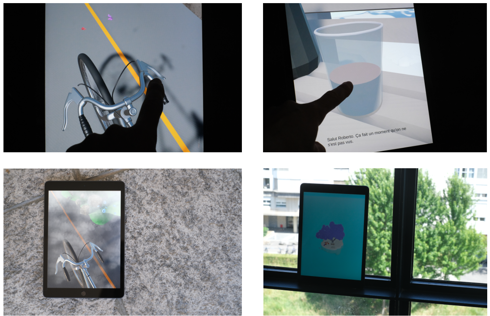

# Thé Ou Café

An interactive iPad story inspired by the night patrols conducted in Geneva by social workers’ associations, it explores various encounters with people living on the streets through moments of presence and human connection. Season after season, we meets Roberto, a person living on the street, who gradually reveals more of his personality each time, and through these repeated meetings, a relationship slowly takes shape between them.

## Links

- Final [Presentation](TheOuCafe_Presentation.pdf) for the Bibliothèque de la Cité in Geneva
- [Images](./images) for the presskit
- [Demo video](https://youtu.be/AOdLq7y0Xkg) on YouTube

The interactive docu-fiction aesthetic style, evolving through the seasons. 

The iPad experience immersed in the real world, and interactions with it. 

# Team

- Elena Gazzarrini
- Vincent Paley 
- Antony Neyret