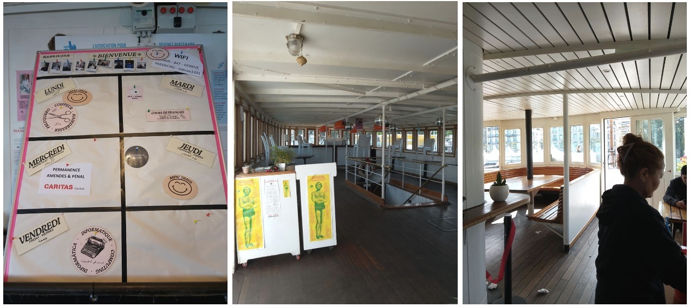
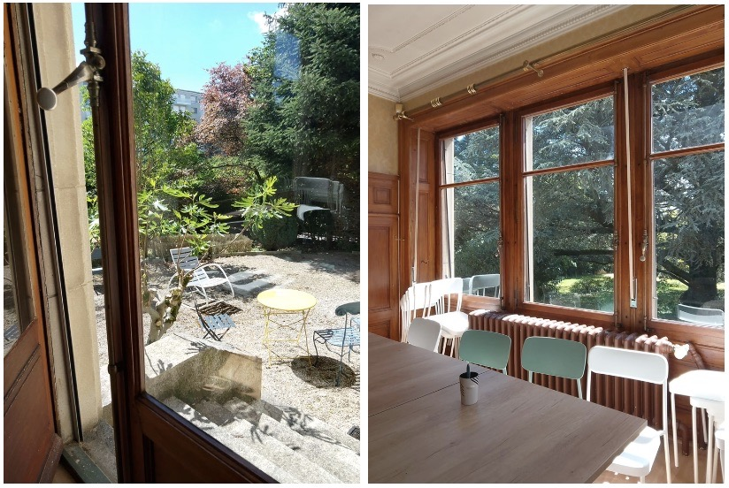

# Bateau Genève

**07.05.2026 — 10h–11h**

J'arrive, je monte les escaliers de ce beau bateau en face à eaux vives. Dans la buvette, ils offrent un repas chaud a tout le monde. Les gents qui cuisinent sont des bénévoles. Je rencontre 2 amis qui sont des travailleurs sociales, en stage. L'atmosphère est belle et conviviale, et le public est apparentemente divisée discrètement en 2 : a un côté de bateau, il y a les gents sans abri, a l'autre les gents qui ont pas l'aire de l'être.

Un panneau montre le calendrier de la semaine. Pendant que je regarde, toute suite je suis accueil par une femme d'environ 40 ans, Magie, qui m'explique que il y a les vendredi informatiques pour expliquer comment écrire un CV, et aussi que le bateau c'est le centre postale pour les sans abri. *(Ca pourrais être intéressant de raconter ça, métaphore de sans abri, pas de casse postale)*

Elle me raconte de les violences qu'elle a subi dans la roue par les hommes. C'est difficile déjà être dans la rue, en plus si tu est une femme.

Je lui demande de les maraudes, elle dit ils sont le point central et essentials de contact pour SE réinsérer dans la société. Elle me parle de Saskia, cofondatrice de l'association maraude.

**Son histoire :** elle arrive à Genève par hasard, elle est saturé de sa vie en France (pas d'argent, pas de maison) et décide de prendre un train, elle arrive à Genève, elle trouve un grand cèdre dans la perle du lac, un arbre grande et solitaire, beau. Elle voit que il y a une tente a côté de l'arbre, c'est vide. Elle squat la tente.

Une nuit, une femme (Saskia) arrive, elle lui offre un the, un café, après elle lui demande depuis combien de temps elle est la. *"Depuis que 3 semaines, tranquilo."* Elle lui dit d'aller à le bateau Genève. Après, elle trouve un lieu sous le ponte des acacias en attendant une place dans un hébergement. Cette fois, c'est pas la pole a la faire partir, mais la pluie : larve débordé, et prends sa tente avec tous les affaires.

Maintenant elle va mieux, elle fait un stage a le bateau Genève.

---

# Association Femmes à Bord

**07.05.2026 — 11h30**

Je suis assise dans une belle maison dans un parc ensoleillé. Des femmes de tous les types, d'habitude en situation de précarité, parlent en langues différentes autour de moi. Ce sont les travailleuses sociales de Bateau Genève qui ont fondé l'association, en constatant que les femmes n'avaient pas trop de place et ne se mettaient pas en avant au bateau, où 95 % des habitués sont des hommes. Comme ça, elles ont fondé l'association Femmes à bord, d'où le nom.

Je suis accueillie par Jasmine, ici en stage. Elle m'explique comment la maison fonctionne, quel type de soins (nourriture, habits, produits hygiéniques, des lits pour faire des siestes) ils offrent aux femmes. Les enfants ne sont pas acceptés. C'est ouvert 2 fois par semaine.

L'atmosphère est calme et conviviale, tout le monde a l'air heureux. Aujourd'hui, conseil juridique pour tout le monde. Tout le monde a l'air propre et bien mis. Mais j'entends : « aujourd'hui, le point d'eau ne marchait pas, je n'ai pas pris de douche ». Les femmes sont toujours élégantes.

Je parle avec X, qui me raconte comment elle était journaliste médicale à Montréal, mais que le Covid était une conspiration et un génocide, et qu'elle était en danger de vie ou de mort parce qu'elle était honnête, et alors elle est partie ici. Mais aussi ici, il y a de la corruption partout. Elle habite avec des gens, mais elle vient ici pour trouver de nouvelles colocataires femmes.
