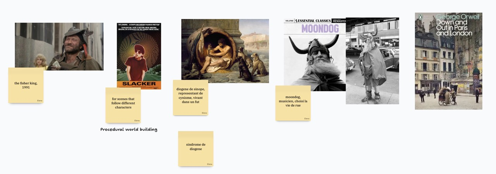
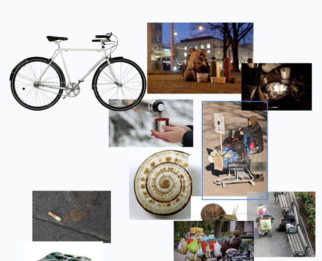

notes manuscrites: [20260429](scans/20260429.jpg)

Le projet est très orienté sur les personnes et les instituons sociales. La rue est le seul endroit Plus général, un lieu ou tous les gens se rencontres. Rapport suisse à la rue très silencieuse en suisse. Habiter la rue.

- Observation dans la rue.
- Errer dans les rues, pavaner

**Livre**: Le journal d’un voleur.

### Evocateurs de la rue

Fog, oiseau, "zombies qui sortent du brouillard ». Foggy people, en Californie. Bruit, horaires, nettoyer. Les traces que l’on laissent dans la rue. évoquant du passage de quelqu’un. Invisiblisé.
Poubelles ramasser les déchets dans la rue.

Les cafés suspendus est mentioned.
La rue est présente partout pas seulement dans le coin de la carte.

### Idées Observations
- Differentes ambiances en fonction de la journée.
- Les Grottes, Gare cornavin.
- Route = flux
- Est-ce possible de faire un alternate (possible) futures.
- Montrer que c’est possible.

Raconteur.
- Slacker: https://www.youtube.com/watch?v=i3jWwtLVWRI
- The fisher king,  Terry Gilliam, 1991
- Urchin, Harry Dickinson, 2025

### Lieux

Street workout
Rue de Berne, Rue de la navigation
Jonction, place des volontaires

Ne pas oublier le Care.

## Maraude

Témoignage d’Amela, maraudegeneve.ch

- Souvenir de mon anniversaire
- Prendre le temps