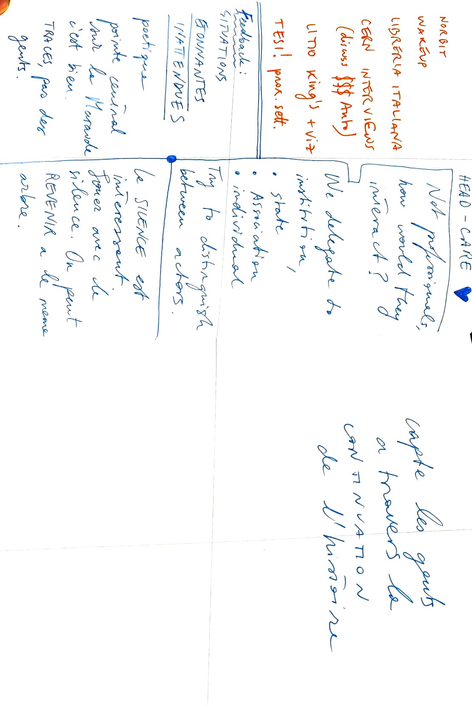
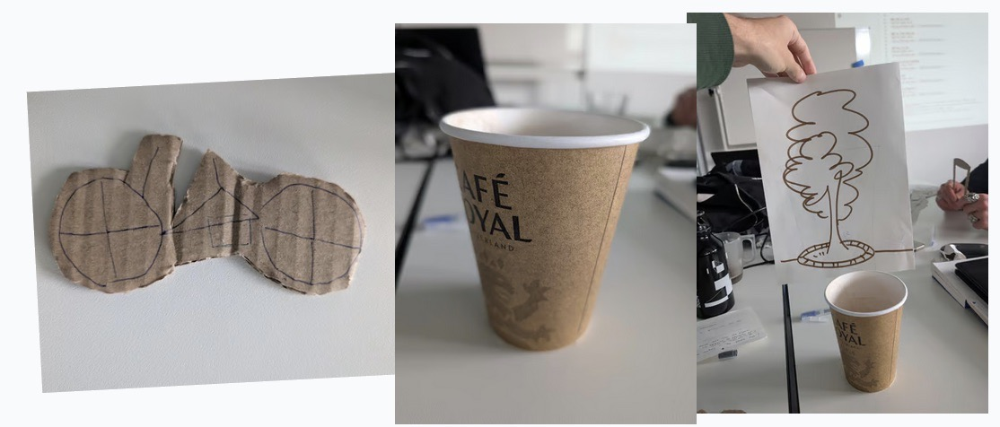

Prendre le temps d'écouter la rue autour d'une tasse de café.
Partager un moment avec les personnes de la rue autour du thé et du café.

Revenir plusieurs fois au même endroit.
Revenir au même endroit si tu n'a pas pris le temps la première fois.

Arbre de decision --> scénario évolutifs.

- Tricks de scène de l'histoire courte, sans sons, juste prendre du temps sans parole.
- Scènes courtes: "non, merci partez!"
- Evolution de la scène lorsqu'on revient à une situation quelque chose à changer

# Scènes

1. Vélos qui se déplacent en ville -> gros plan sur le dérailleur + la route en background
2. Goblet qui se rempli (core interaction)
3. Environnement (lié à la la scène 2)

Presse le doigt, le verre se rempli. -> deux interactions à tester:

1. Je presse, le verre se rempli le verre se vide aussi lors du presse

- Buisson / arbre 
- Banc
- Vitrine

## Discussion

- Est-ce que la scène du vélo est interactive -> à tester en grayboxing
- Quel est le POV de la scène du vélo.

# Grayboxing

- [ ] Gray boxing interface = goblet
- [ ] Gray boxing des petites scènes
