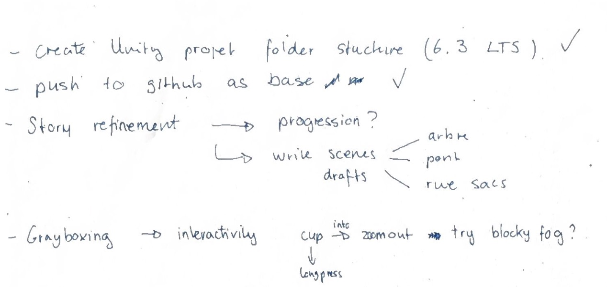
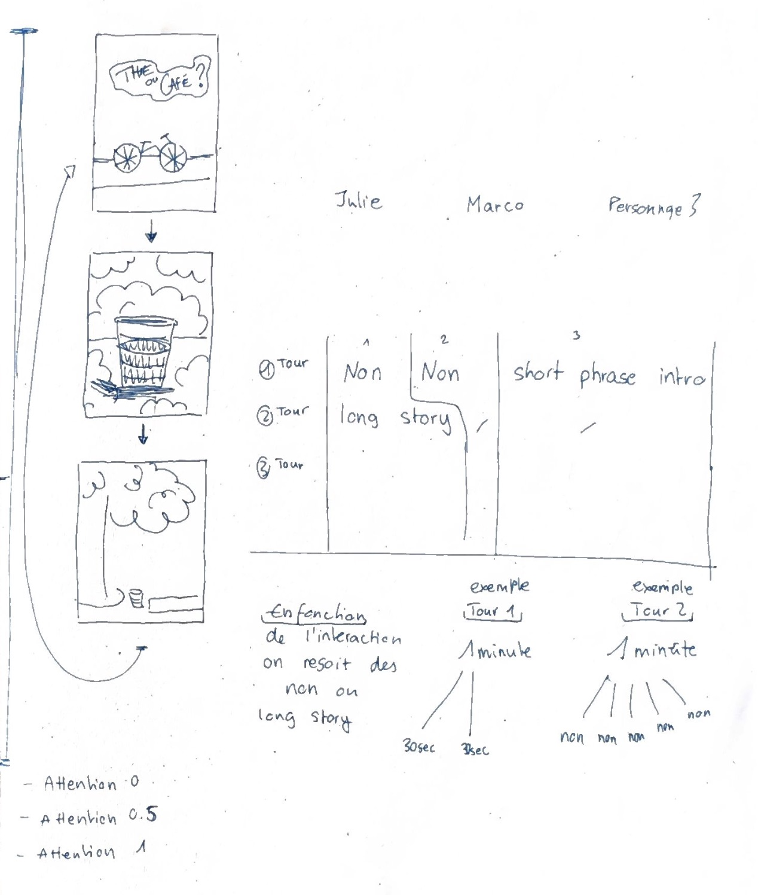

# Todo

# Scènes

1. Arbre + banc
2. Sac de couchage bord de la rue
3. Pont + zoom out

Une réflexion sur comment devrait se dérouler l'histoire.

## 1.  Arbre: Marco (essai d'une histoire)

- Salut, tu as fait quoi aujourd'hui ?
- Tu veux du thé ou du café?

Du thé.

Je suis allé faire ma lessive. Et après je me suis baladé un peu à côté du Rhône.

Ah et j'avais pas prévu de dormir ici ce soir mais j'ai passé la journée à chercher un téléphone, le mien a plus de batterie pour appeler le numéro d'hébergement d'urgence 

Personne ne m'a prêté un téléphone. Mais bon, il y a pire dans la vie!

- Tu veux qu'on appelle avec toi demain matin ?

Je veux pas vous embêter.

- Pas du tout, ok on repassera demain matin.

Ne raconte pas toute son histoire dès le début.
Se livre de plus en plus.

# Yarn Spinner

We can add the audio and the text and also make jumps in deferent scenes. Trop cool!

# Feedback on our test

Our interaction to test was the cup, when you long press it fills (while pressing), puis se vide et zoom en arrière pour découvrir la scène. La scène n'est découverte qu'en fonction du pourcentage du goblet rempli.

- multiple tap to fill the cup?
- press at least several seconds for the zoom out to be triggered. otherwise no zoom.
- Show hints of things happening at different fill levels. Maybe some sort of magnetism?, or color?, or graduations on the cup ? 
- We can punish people who over interact with a storytelling trick.

