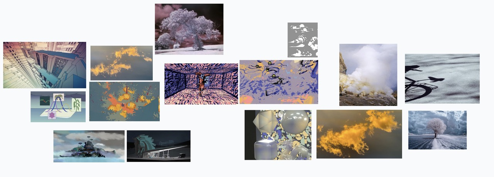
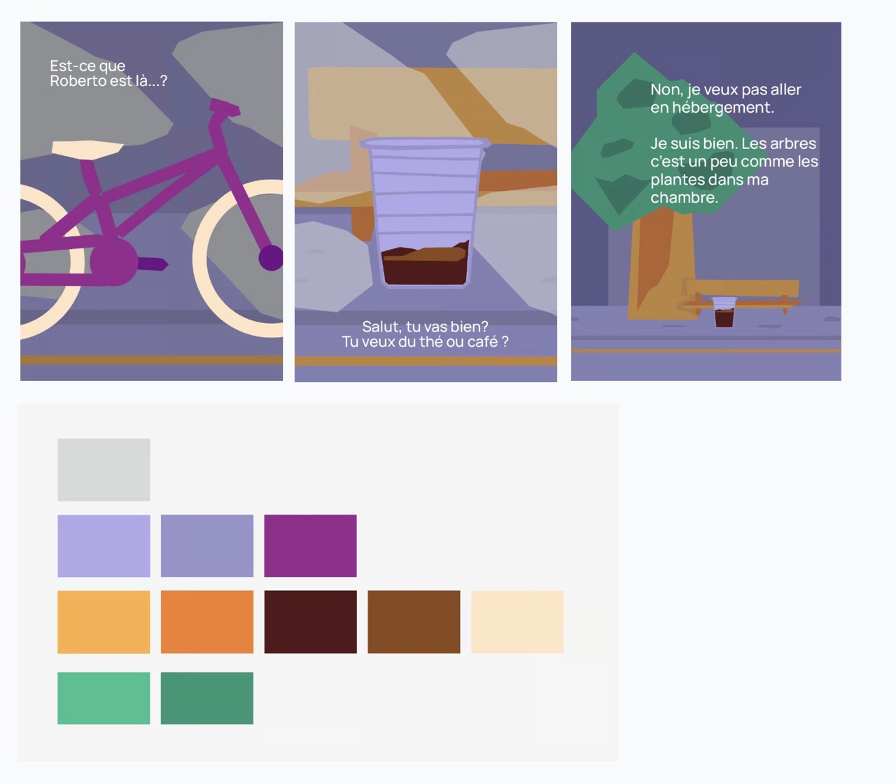

# Art Direction

## Feeling

- decor is hidden
- fog everywhere, we see only half part of the objects.
- start of the evening / sunset
- feeling is relax/mysterieux/nostalgique.
- we are at the beginning of autumn

## Interaction

the visitor approaches the iPad. a bike is moving through the street.
- the bike is party hidden, we see the shadow mostly
- the street is partly hidden and moves fast around us.
- sounds of the street_ambient+sound of the bike chain/pedals.
- touch the bike to stop it
- short press: bike slows down.
- long press: bike brakes and glass scene starts. satisfying.
- if no interaction: you keep wondering in the foggy streets.

- glass scene: glass is less opaque than the rest of the scene.
- press the glass to fill it.
- as story unfolds, world take on some color as camera moves away from scene

# Feedback 

**1.06 (art direction)** :

- not a really defined artistic direction
- lots of different directions
- colors are kind of clear
- what about the 3D direction?
- what is relax, misterious?

**interaction**:

- Pretty clear 
- the bike is on a slope, when you slow it down it gain speed again